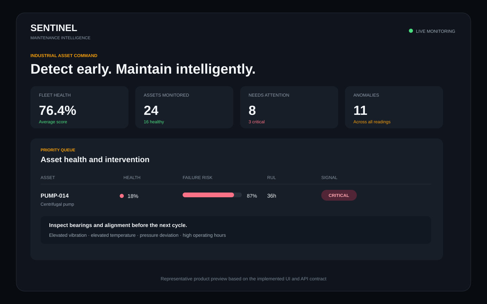
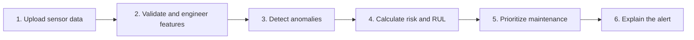
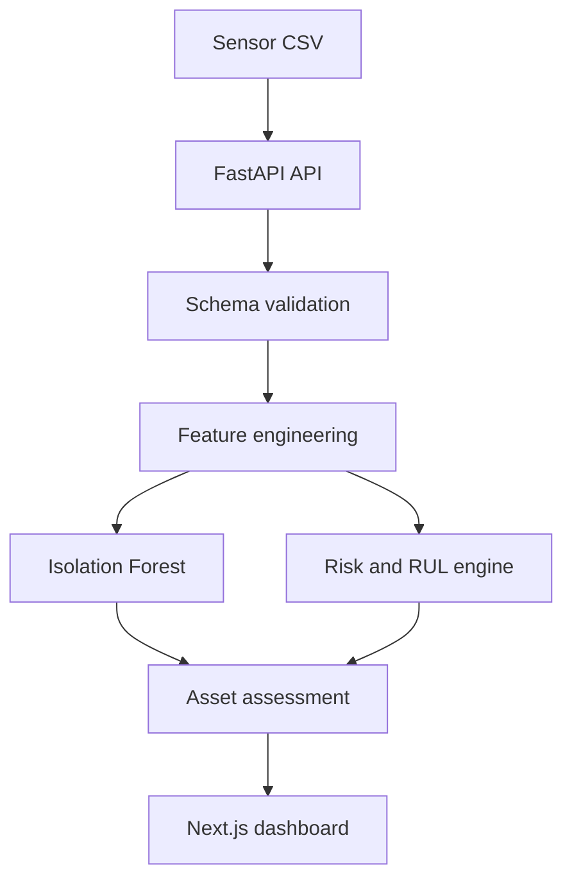

# Predictive Maintenance and Anomaly Detection



> Representative preview generated from the implemented frontend layout and verified API response fields.

A full-stack industrial analytics application that converts equipment sensor readings into anomaly alerts, explainable failure-risk scores, health trends, and maintenance recommendations.

**Live application:** [Open dashboard](https://predictive-maintenance-and-anomaly-detection-paramasiva.vercel.app)  
**Live API:** [Service](https://predictive-maintenance-and-anomaly-chld.onrender.com) · [API documentation](https://predictive-maintenance-and-anomaly-chld.onrender.com/docs) · [Health check](https://predictive-maintenance-and-anomaly-chld.onrender.com/health)

## Product Walkthrough



### Example asset assessment

**Input signals**

```text
Asset: PUMP-014
Temperature: elevated
Vibration: elevated
Pressure: outside normal range
Operating hours: high
```

**Representative output**

```json
{
  "asset_id": "PUMP-014",
  "status": "critical",
  "failure_risk": 87,
  "health_score": 18,
  "estimated_rul_hours": 36,
  "maintenance_priority": "immediate",
  "recommended_action": "Inspect bearings and alignment before the next cycle."
}
```

The dashboard then shows fleet KPIs, priority assets, anomaly history, and the sensor conditions that contributed to each recommendation. This example illustrates the implemented assessment workflow; it is not a measured failure-prediction result.

### API example

```bash
curl http://localhost:8000/api/overview
curl http://localhost:8000/api/assets/PUMP-014
```

```json
{
  "total_assets": 24,
  "healthy_assets": 16,
  "attention_assets": 5,
  "critical_assets": 3,
  "anomalies_detected": 11,
  "average_health_score": 76.4,
  "priority_assets": ["highest-risk asset assessments"]
}
```

## The Problem

Reactive maintenance can lead to unplanned downtime, while fixed schedules may service healthy equipment too early. Maintenance teams need a clear way to identify unusual operating conditions, prioritize assets, and understand why a machine has been flagged.

## The Solution

The platform ingests time-series sensor data, validates the schema, engineers operating features, and applies an Isolation Forest to identify multivariate anomalies. A transparent risk layer combines sensor stress, operating hours, and anomaly severity into a 0–100 risk score, estimated remaining useful life, maintenance priority, and recommended action. FastAPI serves the analysis to a Next.js dashboard.

## Tech Stack

**Python | pandas | NumPy | scikit-learn | FastAPI | Next.js | TypeScript | Docker | GitHub Actions**

> AWS deployment and MLflow tracking are production-roadmap items; they are not claimed as part of the current implementation.

## Architecture



## Key Features

- Display fleet-level health and maintenance KPIs
- Detect multivariate operating anomalies with Isolation Forest
- Score failure risk from temperature, vibration, pressure, RPM, hours, and anomaly severity
- Estimate remaining useful life for decision support
- Assign maintenance priority and recommended action per asset
- Visualize sensor history and health trends
- Upload replacement CSV data with schema validation
- Explore results through FastAPI endpoints and a Next.js dashboard
- Run frontend and backend with Docker Compose
- Validate the backend with tests and GitHub Actions CI

## Results

The application produces a complete assessment for every asset: anomaly state, explainable 0–100 risk score, estimated RUL, priority, and recommended action. The included dataset is synthetic, so the outputs demonstrate the engineering workflow rather than certified predictive performance. Precision, recall, alert lead time, and avoided-downtime metrics require labeled maintenance history and are not fabricated here.

## Cloud Deployment

The FastAPI analytics service is deployed as a Docker container on Render with automatic deployment from GitHub, dynamic port configuration, a public health endpoint, and interactive OpenAPI documentation.

- **Frontend dashboard (Vercel):** https://predictive-maintenance-and-anomaly-detection-paramasiva.vercel.app
- **Backend service (Render):** https://predictive-maintenance-and-anomaly-chld.onrender.com
- **API documentation:** https://predictive-maintenance-and-anomaly-chld.onrender.com/docs
- **Health check:** https://predictive-maintenance-and-anomaly-chld.onrender.com/health
- **Fleet overview:** https://predictive-maintenance-and-anomaly-chld.onrender.com/api/overview

The Next.js dashboard is deployed on Vercel and connects to the containerized FastAPI service on Render through an environment-configured API URL and restricted CORS policy.

## Screenshots / Demo

The demo exposes:

- Live analytics dashboard: [https://predictive-maintenance-and-anomaly-detection-paramasiva.vercel.app](https://predictive-maintenance-and-anomaly-detection-paramasiva.vercel.app)
- Live API documentation: [https://predictive-maintenance-and-anomaly-chld.onrender.com/docs](https://predictive-maintenance-and-anomaly-chld.onrender.com/docs)

After startup, review the fleet overview, open an individual asset to inspect its sensor history and risk explanation, then upload a valid CSV to rerun the analysis.

## How to Run

### Prerequisites

- Docker and Docker Compose

### Setup

```bash
git clone https://github.com/ParamasivaVemavarapu/Predictive-Maintenance-and-Anomaly-Detection.git
cd Predictive-Maintenance-and-Anomaly-Detection
cp backend/.env.example backend/.env
docker compose up --build
```

## Dataset Schema

The uploaded CSV must contain:

```text
timestamp, asset_id, asset_type, temperature_c, vibration_mm_s,
pressure_bar, rpm, operating_hours
```

## API

| Method | Endpoint | Purpose |
|---|---|---|
| `GET` | `/health` | Check API health |
| `GET` | `/api/overview` | Return fleet KPIs and priority assets |
| `GET` | `/api/assets` | Return the latest assessment for each asset |
| `GET` | `/api/assets/{asset_id}` | Return asset history and assessment |
| `GET` | `/api/anomalies` | Return detected anomalous readings |
| `POST` | `/api/data/upload` | Replace the active sensor dataset |

## Model Design

Isolation Forest identifies uncommon multivariate states without requiring failure labels. The explainable risk layer then converts normalized sensor stress, equipment age, and anomaly severity into operational decision support. Risk and RUL estimates are not manufacturer-certified predictions.

## Engineering Quality

This repository includes modular Python services, typed API contracts, environment-based configuration, automated tests with coverage, Ruff linting, TypeScript checks, reproducible Docker builds, and GitHub Actions CI. See [Engineering Quality](docs/ENGINEERING.md) for the quality gates and production-readiness boundary.

## Production Roadmap

- Add centralized application metrics and uptime monitoring
- Train supervised failure and RUL models on labeled history
- Track experiments and register models with MLflow
- Deploy services on AWS with managed storage and monitoring
- Backtest precision, recall, alert lead time, and avoided downtime
- Add streaming ingestion, drift monitoring, CMMS integration, RBAC, and audit logs

## Reproducible Evaluation

The versioned [evaluation suite](evaluation/README.md) calculates alert precision, recall, mean alert lead time, and per-feature Population Stability Index drift signals.

```bash
python evaluation/evaluate.py
```

The included backtest data is synthetic and validates evaluation behavior. Field performance requires time-split equipment history with verified maintenance outcomes.

## License

MIT
