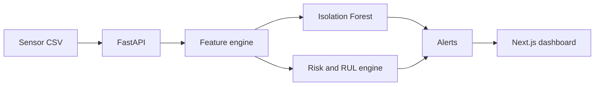

# Predictive Maintenance and Anomaly Detection

A full-stack industrial analytics platform that converts equipment sensor readings into anomaly alerts, failure-risk scores, health trends, and actionable maintenance recommendations.

## Features

- Fleet health overview for industrial assets
- Isolation Forest multivariate anomaly detection
- Explainable failure-risk scoring using temperature, vibration, pressure, RPM, operating hours, and anomaly severity
- Estimated remaining useful life (RUL)
- Maintenance priority and recommended action for every machine
- Time-series sensor and health visualization
- CSV upload with schema validation
- FastAPI analytics API, Next.js dashboard, Docker, tests, and GitHub Actions CI

## Architecture



## Quick Start

```bash
cp backend/.env.example backend/.env
docker compose up --build
```

- Dashboard: http://localhost:3000
- API docs: http://localhost:8000/docs

## API

| Method | Endpoint | Description |
|---|---|---|
| `GET` | `/health` | API health |
| `GET` | `/api/overview` | Fleet KPIs and priority assets |
| `GET` | `/api/assets` | Latest health assessment by asset |
| `GET` | `/api/assets/{asset_id}` | Asset history and assessment |
| `GET` | `/api/anomalies` | Detected anomalous readings |
| `POST` | `/api/data/upload` | Replace active sensor CSV |

## Dataset Schema

`timestamp`, `asset_id`, `asset_type`, `temperature_c`, `vibration_mm_s`, `pressure_bar`, `rpm`, `operating_hours`

The included dataset is synthetic and intended only to demonstrate the engineering workflow. Risk and RUL outputs are decision-support estimates, not manufacturer-certified predictions.

## Model Design

Isolation Forest detects unusual multivariate operating states. A transparent domain-risk layer converts normalized sensor stress, equipment age, and anomaly severity into a 0–100 failure-risk score. This makes the portfolio demo explainable: each maintenance recommendation includes the conditions that contributed to it.

## Production Roadmap

- Train supervised failure and RUL models on labeled maintenance history
- Backtest alert precision, recall, lead time, and avoided downtime
- Add streaming ingestion with Kafka and a time-series database
- Add model registry, drift monitoring, alert acknowledgement, and CMMS integration
- Add tenant isolation, RBAC, audit logs, and manufacturer-specific thresholds

## License

MIT
